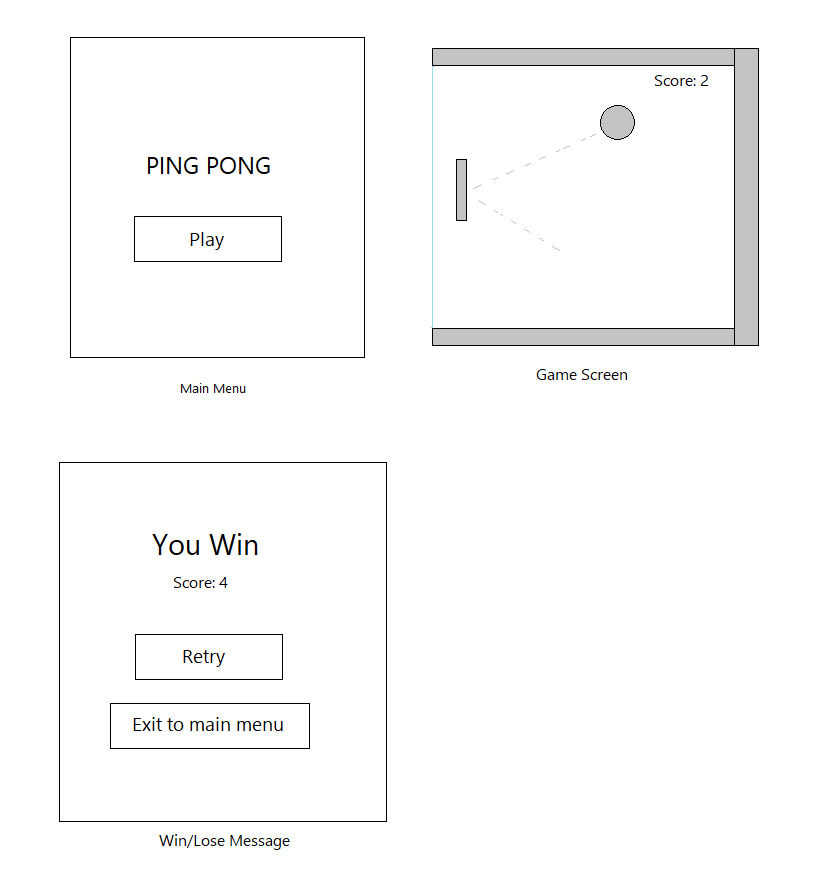

# Unity Game Development Assignment

In this assignment, you have to develop a simple ping-pong game in Unity (C#).  
_Wireframes are provided at bottom for reference._

## TASK OVERVIEW

The game should have following features:

- **Main Menu**:
  - _Title_ with name of the game
  - _Play_ button
- **Game Screen**
  - _Paddle_: a paddle that can be moved vertically using touch or arrow keys
  - _Ball_: the ball that bounces back when hit by the paddle or walls
  - _Closed-Walls_: the walls prevent ball or paddle from going off-screen
  - _Score_: Each time ball hits the paddle, score number increases
- **Win/Lose Message**
  - When a player wins or loses, a screen with the message _‘You Win’_ or _‘You Lose’_ and the _scores_ will be shown.
  - This screen will have a button to _Retry_ which will start the game again
  - And a button to _Exit_ to Main Menu

## Gameplay:

- Move paddle up or down using touch or arrow keys to hit the ball
- Player loses if ball gets behind the paddle (out of screen from the left wall)
- Player wins when ball hits the paddle _10_ times

## Submission:

1. Fork this repository
1. Complete the tasks while following all instructions
1. Include steps to install and run the program in the README.md file of repo
1. When done, test if all task requirements are met and instructions followed
1. Push the code to your github repository
1. Reply to the same email with repo link and a video of demo

_for any queries, please email us at hiring@truevalueaccess.com_

## Wireframes:

